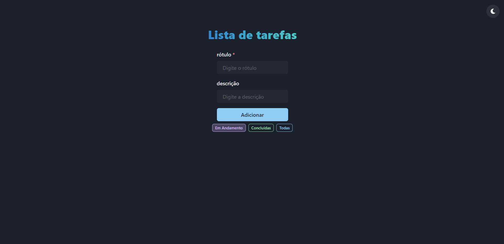

[](https://www.typescriptlang.org/) [](https://pt-br.reactjs.org/) [](https://redux.js.org/) [](https://chakra-ui.com/) [](https://react-icons.github.io/react-icons/)

**[CLIQUE AQUI](https://redux-todo-sigma.vercel.app/)** para testar (by Vercel)!

 <p align="center">
  <a src="#" target="_blank"></a>
</p>

- Primeiro clone este repositório

```jsx
git clone https://github.com/pedrolucazx/redux-todo
```

- Entre na pasta todo-ts-redux

```jsx
cd todo-ts-redux
```

- Execute yarn para instalar as dependências

```jsx
yarn;
```

- Execute yarn dev para rodar o projeto em http://localhost:3000/

```jsx
yarn dev
```
